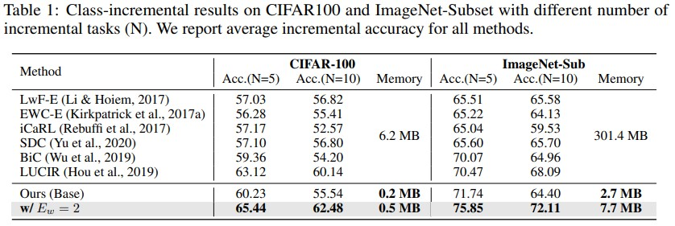

# Continual Learning With Filter Atom Swapping
Pytorch Implementation of **Continual Learning With Filter Atom Swapping** (ICLR'22 Spolight) 
[Paper](https://openreview.net/pdf?id=metRpM4Zrcb)

If you find this repo helpful for your work, please cite the following bib entries:

    @inproceedings{Miao_2022_CLatoms,
    title={Continual Learning With Filter Atom Swapping},
    author={Miao, Zichen and Wang, Ze and Chen, Wei and Qiu, Qiang},
    booktitle={International Conference on Learning Representations},
    year={2022}}

# Requirements
- [PyTorch >= version 1.8](https://pytorch.org)

# Class-incremental experiments

## Dataset
CIFAR100 will be automatically downloaded to 'Datasets' dir. Please download ImageNet to 'Datasets/ImageNet'

## Training Scripts
cifar100 (N=5)

    $ ./train_dcf_c100.sh 6 GPU_TO_USE

cifar100 (N=10)

    $ ./train_dcf_c100.sh 11 GPU_TO_USE

ImageNet-Sub (N=5)

    $ ./train_dcf_img100.sh 6 GPU_TO_USE

ImageNet-Sub (N=10)

    $ ./train_dcf_img100.sh 11 GPU_TO_USE

## Results

    

